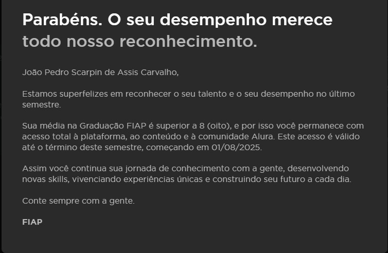
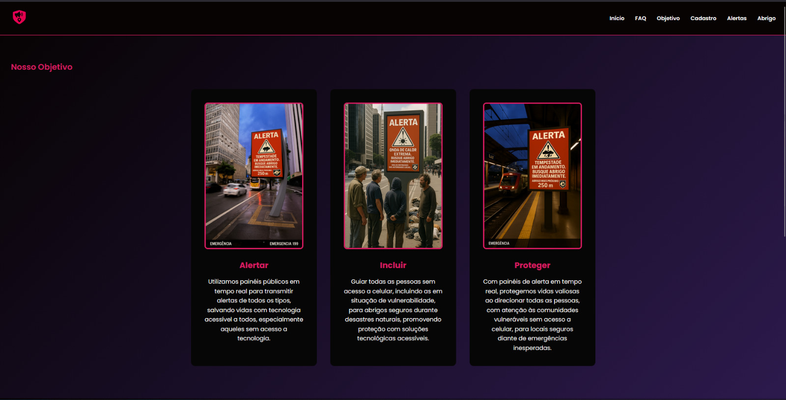

# Olá, sou João Pedro Scarpin 👋

### 💻 Sobre mim

Sou um estudante de Análise e Desenvolvimento de Sistemas na **FIAP**, com um forte interesse e paixão pelo universo do **backend**. Gosto de construir a lógica por trás das aplicações e de trabalhar com tecnologias como **Java** e **Python**. Estou sempre em busca de aprimorar minhas habilidades e de criar soluções eficientes e seguras.

---

### 🛠️ Habilidades
-    **Linguagens:** `JavaScript` `Python` `Java` `React`
-   **Bancos de dados:** `OracleSQL`
-   **Ferramentas:** `Git`  `VS Code` `IntelliJ`

---

### 🚀 Projetos em Destaque

* **[ConectaCare]** - Projeto da faculdade em parceria com o Hospital das Clínicas.
    [Link para o repositório](https://github.com/Scarpin12/Conecte-Care-HC)

* **[UrbanCare]** - Projeto da faculdade para fornecer suporte a comunidades vulneráveis, utilizando tecnologia acessível com painéis públicos em tempo real.
    [Link para o repositório](https://github.com/Scarpin12/UrbanCare)

---

### 📊 GitHub Stats

---

### 📫 Conecte-se comigo

    
    

---

| FIAP | Tecnólogo em Análise e Desenvolvimento de Sistemas |
| - | - |
|  | Jan 2025 - Dez 2026 (em andamento)    **Áreas de Estudo:**   Inteligência Artificial & Chat-bot (usando IBM WatsonX, IBM Cloud)   Construção de Banco de Dados Relacional (usando Oracle SQL Database Modeler)   Pensamento Computacional com Python   Domain Driven Design com Java (usando IntelliJ)   Engenharia de Design Front-end (HTML, CSS, JavaScript, Figma, React, TypeScript, NodeJs)   Engenharia de Software e Modelo de Negócios (Jira, Miro, Scrum, Kanban) |

>[!TIP]
> Minha desempenho  atual na **Universidade FIAP** é:
>
>

>[!IMPORTANT]
> Em Julho de 2025, participamos do Hackathon da FIAP sobre a Crise Climática, também conhecido como **Global Solution**.
>
> Meu colega de equipe e eu desenvolvemos uma grande ideia de projeto sobre a crise climática com sensores barométricos, múltiplos modelos de machine learning, data lake e um grande chatbot em apenas 12 dias. Nós também entregamos o S.I.R.E.N.A. (Sistema Integrado de Resposta às Emergências e Notificações Ambientais), um sistema de simulação que gerencia estruturas de dados, GPS e histórico de incidentes ambientais para sugerir ao usuário que se mova para um local mais seguro.
>
> [Confira nosso repositório sobre o Global Solutions 2025.1](https://github.com/Scarpin12/UrbanCare) -> NOTA **92/100**
>
> 

    
